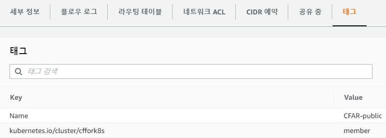
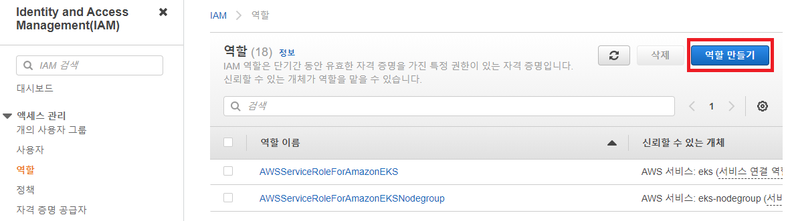
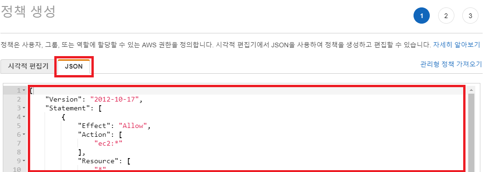
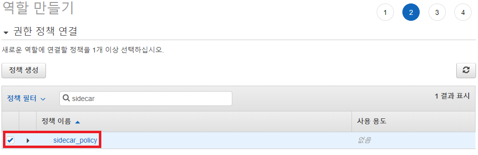
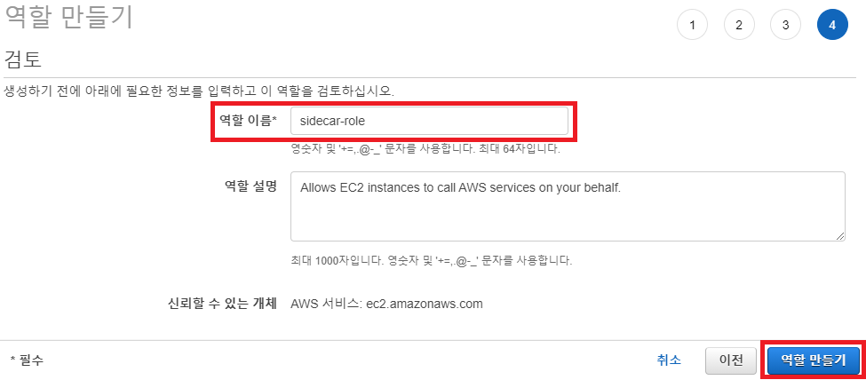
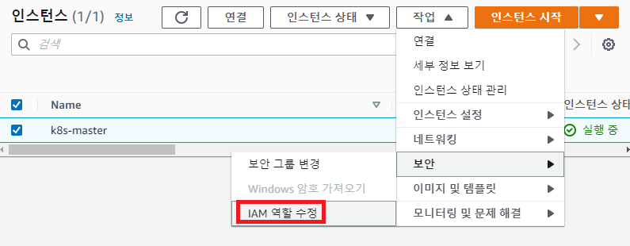
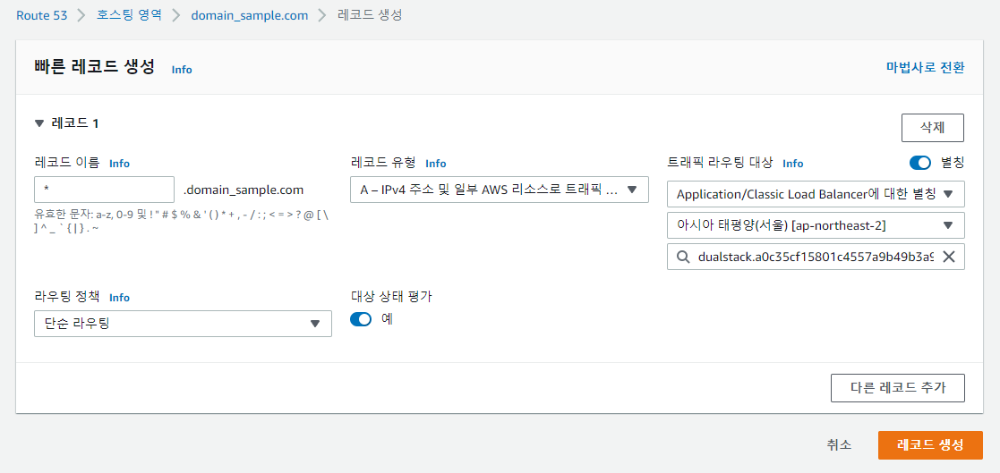

### [Index](https://github.com/K-PaaS/Guide-eng/blob/master/README.md) > [K-PaaS Sidecar Install](./README.md) > Sidecar

## Table of Contents

1. [Document Outline](#1)  
  1.1. [Purpose](#1.1)  
  1.2. [Range](#1.2)  
  1.3. [References](#1.3)  

2. [Configuring a Kubernetes Cluster with Kubespray](#2)  
  2.1. [Prerequisite](#2.1)  
  2.2. [AWS Settings (When Using AWS Environment)](#2.2)  
    ※ [(Refer) AWS IAM Settings](#2.2.1)  
  2.3. [NFS Setting (when deploying NFS)](#2.3)  
  　2.3.1 [Linux Kernel Version Upgrade](#2.3.1)  
  　2.3.2 [NFS Installation](#2.3.2)  
  　　2.3.2.1 [Server](#2.3.2.1)  
  　　2.3.2.2 [Client](#2.3.2.2)  
  　　2.3.2.3 [Test](#2.3.2.3)  
  2.4. [Create and Deploy SSH Key](#2.4)  
  2.5. [Kubespray Download](#2.5)  
  2.6. [Kubespray Installation Preparation](#2.6)   
  2.7. [Change Kubespray Settings for Sidecar Installation](#2.7)  
  2.8. [Kubespray Installation](#2.8)  
  2.9. [Kubespray Installation Check](#2.9)  
    ※ [(Refer) Delete Kubespray](#2.9.1)

3. [K-PaaS Sidecar Installation](#3)  
  3.1. [Introduction to Executable Files](#3.1)  
  3.2. [Download Executable Files](#3.2)  
  3.3. [Activate Istio CNI Plugin](#3.3)  
  3.4. [variable Settings](#3.4)  
  3.5. [Create Sidecar Values](#3.5)  
  3.6. [Create Sidecar Deployment YAML](#3.6)  
  3.7. [Sidecar Installation](#3.7)  
  　※ [LoadBalancer Domain Connection During AWS-Based Sidecar Installation](#3.7.1)  
  3.8. [Sidecar Login and Deployment of Test App](#3.8)  
    ※ [(Refer) Sidecar Deletion](#3.8.1)  

<br><br>

# <div id='1'> 1. Document Outline
## <div id='1.1'> 1.1. Purpose
The purpose of this document is to provide a guide for configuring the Kubernetes Cluster with Kubespray used for exclusive deployment of K-PaaS Container-Platform and installing K-PaaS Sidecar (hereinafter referred to as Sidecar) in the environment.

<br>

## <div id='1.2'> 1.2. Range
This Document was written based on [cf-for-k8s v5.4.2](https://github.com/cloudfoundry/cf-for-k8s/tree/v5.4.2), [container-platform v1.4.0.1](https://github.com/K-PaaS/container-platform/blob/master/install-guide/standalone/cp-cluster-install.md).    
This document is based on the installation of Sidecar after configuring the Kubernetes Cluster by utilizing K-PaaS Container-Platform Single Distribution (Kubespray) in AWS and Openstack environments.  
This document was guided on the premise that there was a basic understanding of IaaS and Kubernetes.  

<br>


## <div id='1.3'> 1.3. References
K-PaaS Container Platform : [https://github.com/K-PaaS/container-platform](https://github.com/K-PaaS/container-platform)  
Kubespray : [https://kubespray.io](https://kubespray.io)  
Kubespray github : [https://github.com/kubernetes-sigs/kubespray](https://github.com/kubernetes-sigs/kubespray)  
cf-for-k8s github : [https://github.com/cloudfoundry/cf-for-k8s](https://github.com/cloudfoundry/cf-for-k8s)  
cf-for-k8s Document : [https://cf-for-k8s.io/docs/](https://cf-for-k8s.io/docs/)  

<br>

# <div id='2'> 2. Configuring a Kubernetes Cluster with Kubespray
The basic Kubernetes Cluster configuration method follows the K-PaaS Container Platform solo deployment installation guide, but there are some options or parts to be modified on IaaS.
Since the Kubernetes Cluster configuration in this guide has been briefly modified in the linked standalone deployment installation guide, see the linked standalone deployment installation guide for a detailed description of the Kubernetes Cluster configuration.

<br>

## <div id='2.1'> 2.1. Prerequisite
Key software and package version information for Kubernetes Cluster configuration can be found in the K-PaaS Container Platform Standalone Deployment Installation Guide.  
In addition, the cf-for-k8s official document recommends the Kubernetes Cluster requirements as follows.
- Kubernetes version : 1.19 ~ 1.22
- At least 5 nodes
- Minimum 4 CPUs per node, 15GB Memory
- Have CNI Plugin with Network Policies
- LoadBalancer Service Provided
- Default StorageClass Set
- Provides OCI-compliant registry (e.g. [Docker Hub](https://hub.docker.com/), [Google container registry](https://cloud.google.com/container-registry),  [Azure container registry](https://hub.docker.com/), [Harbor](https://goharbor.io/), etc....)  
  This guide is based on the Docker Hub. (Account registration required)

<br>

## <div id='2.2'> 2.2. AWS Settings (When Using AWS Environment)
When configuring a Kubernetes Cluster for Sidecar on AWS, IAM authorization is required on the instance that configures the cluster for use with LoadBalancer or Storage.
- Create an IAM role, add the following policy, and apply it when creating an instance. (Refer to AWS IAM settings below when checking the supplementary explanation about IAM settings.)
 ```
  # iam_policy.json
  {
      "Version": "2012-10-17",
      "Statement": [
          {
              "Effect": "Allow",
              "Action": [
                  "ec2:*"
              ],
              "Resource": [
                  "*"
              ]
          },
          {
              "Effect": "Allow",
              "Action": [
                  "elasticloadbalancing:*"
              ],
              "Resource": [
                  "*"
              ]
          },
          {
              "Effect": "Allow",
              "Action": [
                  "route53:*"
              ],
              "Resource": [
                  "*"
              ]
          },
          {
              "Effect": "Allow",
              "Action": "s3:*",
              "Resource": [
                  "arn:aws:s3:::kubernetes-*"
              ]
          },
          {
              "Effect": "Allow",
              "Action": [
                  "ecr:GetAuthorizationToken",
                  "ecr:BatchCheckLayerAvailability",
                  "ecr:GetDownloadUrlForLayer",
                  "ecr:GetRepositoryPolicy",
                  "ecr:DescribeRepositories",
                  "ecr:ListImages",
                  "ecr:BatchGetImage"
              ],
              "Resource": "*"
          }
      ]
  }
  ```

- Add the following tags to the **instance** to configure the cluster and the **subnet** tags used.
```
key = kubernetes.io/cluster/{cluster_name}
value = member
```


<br>

### <div id='2.2.1'> ※ (Refer) AWS IAM Settings
It describes how to set up AWS IAM.  

- AWS IAM Menu - From the Roles menu, select Create Role.  

  
- Proceed to Create Role to select Create Policy.  

  
- Select JSON and paste iam_policy.json at the top.  

  
- After creating a policy, return to Create Role to select the policy created.  

  
- Name it and complete the role.  

  
- Select the role that you created in the IAM role when configuring the EC2 instance.  

  
- If you have configured the instance and you have not set up the IAM, select the role you created by selecting Modify Instance - Task - Security - IAM Role and reboot the instance.  

  
<br>

## <div id='2.3'> 2.3. NFS Setting (When Deploying NFS)
This installation guide is based on installing NFS Server on **Ubuntu 18.04** and NFS Client on **Ubuntu 20.04**. For NFS Server, install it on a separate VM for storage as it will be used for storage in a cluster deployed with Kubespray.

### <div id='2.3.1'> 2.3.1 Linux Kernel Version Upgrade
Starting with Linux Kernel version **v5.9**, xattr is supported on NFS, so if your version is v5.8 or earlier, you will need to perform the following tasks. Proceed on all nodes where the Kubernetes Cluster is installed and on the VM that will be used as the NFS Server.

- Check the Linux Kernel Version.
  ```
  $ uname -a
  Linux kpaas-cp-master 4.15.0-206-generic #217-Ubuntu SMP Fri Feb 3 19:10:13 UTC 2023 x86_64 x86_64 x86_64 GNU/Linux
  ```


- Proceed to download the *.deb files required to upgrade the Linux Kernel version from the following path. The Linux Kernel version in this installation guide is **v5.9**.
  ```shell
  $ cd $HOME
  $ mkdir linux-kernel-5.9
  $ cd linux-kernel-5.9

  $ wget https://kernel.ubuntu.com/~kernel-ppa/mainline/v5.9/amd64/linux-headers-5.9.0-050900-generic_5.9.0-050900.202010112230_amd64.deb \
  https://kernel.ubuntu.com/~kernel-ppa/mainline/v5.9/amd64/linux-headers-5.9.0-050900_5.9.0-050900.202010112230_all.deb \
  https://kernel.ubuntu.com/~kernel-ppa/mainline/v5.9/amd64/linux-image-unsigned-5.9.0-050900-generic_5.9.0-050900.202010112230_amd64.deb \
  https://kernel.ubuntu.com/~kernel-ppa/mainline/v5.9/amd64/linux-modules-5.9.0-050900-generic_5.9.0-050900.202010112230_amd64.deb
  ```

- Run the command below and upgade the Linux Kernel version.
  ```
  $ sudo su
  # dpkg -i *.deb
  # reboot
  ```

- Check the Linux Kernel version after reboot.
  ```
  $ uname -a
  Linux kpaas-cp-master 5.9.0-050900-generic #202010112230 SMP Sun Oct 11 22:34:01 UTC 2020 x86_64 x86_64 x86_64 GNU/Linux
  ```

### <div id='2.3.2'> 2.3.2 NFS Installation
#### <div id='2.3.2.1'> 2.3.2.1 Server
- Update and upgrade package.
  ```
  $ sudo apt -y update && sudo apt -y upgrade
  ```
- Install package.
  ```
  $ sudo apt install -y nfs-common nfs-kernel-server rpcbind attr
  ```
- Check the NFS version that can be used. To activate xattr, versions later than **v4.2** is required.
  ```
  $ sudo cat /proc/fs/nfsd/versions
  # -2 +3 +4 +4.1 +4.2
  ```
- Create the directory to be used in NFS and give authority.
  ```shell
  $ sudo mkdir -p /home/share/nfs
  $ sudo chmod 777 /home/share/nfs
  ```
- Set share directory.
  ```shell
  $ sudo vi /etc/exports

  ## Form : [dir] [IP] [option]
  ## Exaple : /home/share/nfs 10.0.0.1(rw,no_subtree_check,no_root_squash,async)
  /home/share/nfs {{MASTER_NODE_PRIVATE_IP}}(rw,no_subtree_check,no_root_squash,async)
  /home/share/nfs {{WORKER1_NODE_PRIVATE_IP}}(rw,no_subtree_check,no_root_squash,async)
  /home/share/nfs {{WORKER2_NODE_PRIVATE_IP}}(rw,no_subtree_check,no_root_squash,async)
  ...
  ```
  > `rw` - Read Write  
  > `no_subtree_check` - The share directory can have sub directory  
  > `no_root_squash` - The client can have root authority, File will be created as cliend authority  
  > `async` - Respond to requests before they are changed by the request, for better performance
- Restart NFS Server.
  ```shell
  $ sudo /etc/init.d/nfs-kernel-server restart
  ```
- Check the Settings.
  ```shell
  $ sudo exportfs -v
  ```
- Successful Result
  ```
  /home/share/nfs
                <world>(rw,async,wdelay,no_root_squash,no_subtree_check,sec=sys,rw,secure,no_root_squash,no_all_squash)
  ```

#### <div id='2.3.2.2'> 2.3.2.2 Client
- Update and upgrade package.
  ```
  $ sudo apt -y update && sudo apt -y upgrade
  ```
- Install package.
  ```
  $ sudo apt -y install nfs-common attr
  ```
- Create the dirctory to be used at NFS.
  ```shell
  $ sudo mkdir -p /home/share/nfs
  ```
- Set share dirctory.
  ```shell
  $ sudo vi /etc/fstab

  ## Form : [file system] [dir] [type] [option] [dump] [pass]
  ## Example : 10.10.10.122:/home/share/nfs  /home/share/nfs  nfs  noatime,nodiratime,noauto,hard,rsize=1048576,wsize=1048576,timeo=60,retrans=60  0 0
  {NFS_SERVER_PRIVATE_IP}:/home/share/nfs  /home/share/nfs  nfs  noatime,nodiratime,noauto,hard,rsize=1048576,wsize=1048576,timeo=60,retrans=60  0 0
  ```
  > `noatime` - Does not record the access time of the file at the file system meta information   
  > `nodiratime` - Does not record the access time of the directory at the file system meta information  
  > `noauto` - Does not mount automatically when booted 
  > `hard` - Hard mount  
  > `rsize` - The number of bytes NFS uses when reading files from an NFS server The size of the maximum read buffer 
  > `wsize` - The number of bytes used by NFS when writing files to the NFS server The size of the maximum write buffer  
  > `timeo` - The Waiting time of the client before coming to the conclusion that the packet needs to be retransmitted
  > `retrans` - The number of retries after waiting `timeo`.

- Mount the file system.
  ```shell
  $ sudo mount -t nfs -o vers=4.2 {NFS_SERVER_PRIVATE_IP}:/home/share/nfs /home/share/nfs
  ```
- Check the settings.
  ```
  $ mount | grep /home/share/nfs
  /dev/vda1 on /home/share/nfs type ext4 (rw,relatime)
  10.10.10.122:/home/share/nfs on /home/share/nfs type nfs4 (rw,relatime,vers=4.2,rsize=524288,wsize=524288,namlen=255,hard,proto=tcp,timeo=600,retrans=2,sec=sys,clientaddr=10.10.10.244,local_lock=none,addr=10.10.10.122)
  ```

#### <div id='2.3.2.3'> 2.3.2.3 Test
- NFS Client
  ```
  $ cd /home/share/nfs
  
  $ touch test.txt
  $ printf bar | attr -s foo test.txt
  Attribute "foo" set to a 3 byte value for test.txt:
  bar
  $ attr -l test.txt
  Attribute "foo" has a 3 byte value for test.txt
  ```
- NFS Server
  ```
  $ attr -l /home/share/nfs/test.txt
  Attribute "foo" has a 3 byte value for /home/share/nfs/test.txt
  ```
  
<br>

## <div id='2.4'> 2.4. Create and Deploy SSH Key 
All the installation process after creating and deploying SSH Key must be done at the **Master Node**.

- Access to the Master Node and create RSA Public Key.
  ```
  $ ssh-keygen -t rsa
  Generating public/private rsa key pair.
  Enter file in which to save the key (/home/ubuntu/.ssh/id_rsa): [Enter]
  Enter passphrase (empty for no passphrase): [Enter]
  Enter same passphrase again: [Enter]
  Your identification has been saved in /home/ubuntu/.ssh/id_rsa.
  Your public key has been saved in /home/ubuntu/.ssh/id_rsa.pub.
  The key fingerprint is:
  SHA256:pIG4/G309Dof305mWjdNz1OORx9nQgQ3b8yUP5DzC3w ubuntu@kpaas-cp-master
  The key's randomart image is:
  +---[RSA 2048]----+
  |            ..= o|
  |   . .       * B |
  |  . . . .   . = *|
  | . .   +     + E.|
  |  o   o S     +.O|
  |   . o o .     XB|
  |    . o . o   *oO|
  |     .  .. o B oo|
  |        .o. o.o  |
  +----[SHA256]-----+
  ```

- Copy the Public Key to the Master, Worker Node to be used.
  ```
  ## Copy the Public Key Shown
  
  $ cat ~/.ssh/id_rsa.pub
  ssh-rsa AAAAB3NzaC1yc2EAAAADAQABAAABAQC5QrbqzV6g4iZT4iR1u+EKKVQGqBy4DbGqH7/PVfmAYEo3CcFGhRhzLcVz3rKb+C25mOne+MaQGynZFpZk4muEAUdkpieoo+B6r2eJHjBLopn5quWJ561H7EZb/GlfC5ThjHFF+hTf5trF4boW1iZRvUM56KAwXiYosLLRBXeNlub4SKfApe8ojQh4RRzFBZP/wNbOKr+Fo6g4RQCWrr5xQCZMK3ugBzTHM+zh9Ra7tG0oCySRcFTAXXoyXnJm+PFhdR6jbkerDlUYP9RD/87p/YKS1wSXExpBkEglpbTUPMCj+t1kXXEJ68JkMrVMpeznuuopgjHYWWD2FgjFFNkp ubuntu@kpaas-cp-master
  ```

- Copy the public key to the end of the body of the authorized_keys file for the Master and Worker Nodes to use (add it below the existing body content).
  ```
  $ vi ~/.ssh/authorized_keys

  ex)
  ssh-rsa AAAAB3NzaC1yc2EAAAADAQABAAABAQDRueywSiuwyfmCSecHu7iwyi3xYS1xigAnhR/RMg/Ws3yOuwbKfeDFUprQR24BoMaD360uyuRaPpfqSL3LS9oRFrj0BSaQfmLcMM1+dWv+NbH/vvq7QWhIszVCLzwTqlHrhgNsh0+EMhqc15KEo5kHm7d7vLc0fB5tZkmovsUFzp01Ceo9+Qye6+j+UM6ssxdTmatoMP3ZZKZzUPF0EZwTcGG6+8rVK2G8GhTqwGLj9E+As3GB1YdOvr/fsTAi2PoxxFsypNR4NX8ZTDvRdAUzIxz8wv2VV4mADStSjFpE7HWrzr4tZUjvvVFptU4LbyON9YY4brMzjxA7kTuf/e3j Generated-by-Nova
  ssh-rsa AAAAB3NzaC1yc2EAAAADAQABAAABAQC5QrbqzV6g4iZT4iR1u+EKKVQGqBy4DbGqH7/PVfmAYEo3CcFGhRhzLcVz3rKb+C25mOne+MaQGynZFpZk4muEAUdkpieoo+B6r2eJHjBLopn5quWJ561H7EZb/GlfC5ThjHFF+hTf5trF4boW1iZRvUM56KAwXiYosLLRBXeNlub4SKfApe8ojQh4RRzFBZP/wNbOKr+Fo6g4RQCWrr5xQCZMK3ugBzTHM+zh9Ra7tG0oCySRcFTAXXoyXnJm+PFhdR6jbkerDlUYP9RD/87p/YKS1wSXExpBkEglpbTUPMCj+t1kXXEJ68JkMrVMpeznuuopgjHYWWD2FgjFFNkp ubuntu@kpaas-cp-master  
  ```
<br>

## <div id='2.5'> 2.5. Kubespray Download
- Download the Kube spray at the following path using the git clone command. The version of container-platform in this installation guide is **v1.4.0.1** and the version of Kubespray is **v2.20.0**.
  ```
  $ git clone https://github.com/K-PaaS/container-platform-deployment.git -b v1.4.0.1
  ```

<br>

## <div id='2.6'> 2.6. Kubespray Installation Preparation

Predefine the environment variables needed to install Kubespray and run the installation through a shell script.

- Proceed to Kubespray installation path.
  ```
  $ cd container-platform-deployment/standalone/single_control_plane
  ```

- Define the environment variables required to install Kubespray. Hostname and IP information can be found at the location below
  ```
  $ vi cp-cluster-vars.sh
  ```

  ```shell
  ## HostName Information = Input the hostname command at the shell of each host
  ## Private IP Information = Input ifconig and enter the inet ip at the shell of each host
  ## Public IP Information = Input assigned Public IP information, or Private IP information when unassigned 

  #!/bin/bash

  export MASTER_NODE_HOSTNAME={Enter the HostName information of the Master Node}
  export MASTER_NODE_PUBLIC_IP={Enter the Public IP information of the Master Node}
  export MASTER_NODE_PRIVATE_IP={Enter the Private IP information of the Master Node}

  ## Worker Node Count Info
  export WORKER_NODE_CNT={Number of the Worker Node}

  ## Add Worker Node Info
  export WORKER1_NODE_HOSTNAME={Input HostName information of the Worker number 1 Node}
  export WORKER1_NODE_PRIVATE_IP={Input Private IP information of the Worker number 1 Node}
  export WORKER2_NODE_HOSTNAME={Input HostName information of the Worker number 2 Node}
  export WORKER2_NODE_PRIVATE_IP={Input Private IP information of the Worker number 2 Node}
  export WORKER3_NODE_HOSTNAME={Input HostName information of the Worker number 3 Node}
  export WORKER3_NODE_PRIVATE_IP={Input Private IP information of the Worker number 3 Node}
  ...
  export WORKER{n}_NODE_HOSTNAME={Add HostName information variable according to the number of worker nodes}
  export WORKER{n}_NODE_PRIVATE_IP={Add Private IP information variable according to the number of worker nodes}
  ```

- Select the according storage.
  We recommend choosing NFS if you can't add volumes to Node, and Rook-Ceph if you can.
  When selecting NFS, enter the NFS server's Private IP information.

  ```shell
  ...
  ## Storage Type Info (eg. nfs, rook-ceph)
  export STORAGE_TYPE={Input Storage Type information to install}
  export NFS_SERVER_PRIVATE_IP={Input Private IP information of the NFS server when setting Storage Type nfs}
  ...
  ```

<br>

## <div id='2.7'> 2.7. Change Kubespray Settings for Sidecar Installation
- Change the `metrics_server_version` to v0.6.4.
  ```
  $ vi roles/download/defaults/main.yml
  ```

  ```yaml
  ...
  metrics_server_version: "v0.6.4"
  ...
  ```

- Annotiate the following part.
  ```
  $ vi cluster.yml
  ```

  ```yaml
  ...

  # - hosts: kube_control_plane
  # gather_facts: False
  # any_errors_fatal: "{{ any_errors_fatal | default(true) }}"
  # environment: "{{ proxy_disable_env }}"
  # roles:
  #   - { role: kubespray-defaults }
  #   - { role: paasta-cp/istio }
  
  ...
  
  # - hosts: kube_control_plane
  # gather_facts: False
  # any_errors_fatal: "{{ any_errors_fatal | default(true) }}"
  # environment: "{{ proxy_disable_env }}"
  # roles:
  #   - { role: kubespray-defaults }
  #   - { role: paasta-cp/kubeflow }

  ...
  ```
  <br>

## <div id='2.8'> 2.8. Kubespray Installation
The shell script installs the required packages, sets up the Node configuration, sets up the Kubespray installation, and installs Kubespray via Ansible playbook in batches.

```
$ source deploy-cp-cluster.sh
```

<br>

## <div id='2.9'> 2.9. Kubespray Installation Check
Verify the Kubespray installation by checking the Pods in the Kubernetes Node and kube-system Namespace.

```
$ kubectl get nodes
NAME                 STATUS   ROLES                  AGE   VERSION
kpaas-cp-master     Ready    control-plane          12m   v1.24.6
kpaas-cp-worker-1   Ready    <none>                 10m   v1.24.6
kpaas-cp-worker-2   Ready    <none>                 10m   v1.24.6
kpaas-cp-worker-3   Ready    <none>                 10m   v1.24.6
kpaas-cp-worker-4   Ready    <none>                 10m   v1.24.6

$ kubectl get pods -n kube-system
NAME                                          READY   STATUS    RESTARTS      AGE
calico-node-d8sg6                             1/1     Running   0             9m22s
calico-node-kfvjx                             1/1     Running   0             10m
calico-node-khwdz                             1/1     Running   0             10m
calico-node-nc58v                             1/1     Running   0             10m
coredns-657959df74-td5c2                      1/1     Running   0             8m15s
coredns-657959df74-ztnjj                      1/1     Running   0             8m7s
dns-autoscaler-b5c786945-rhlkd                1/1     Running   0             8m9s
kube-apiserver-kpaas-cp-master               1/1     Running   0             12m
kube-controller-manager-kpaas-cp-master      1/1     Running   1 (11m ago)   12m
kube-proxy-dj5c8                              1/1     Running   0             10m
kube-proxy-kkvhk                              1/1     Running   0             10m
kube-proxy-nfttc                              1/1     Running   0             10m
kube-proxy-znfgk                              1/1     Running   0             10m
kube-scheduler-kpaas-cp-master               1/1     Running   1 (11m ago)   12m
metrics-server-5cd75b7749-xcrps               2/2     Running   0             7m57s
nginx-proxy-kpaas-cp-worker-1                1/1     Running   0             10m
nginx-proxy-kpaas-cp-worker-2                1/1     Running   0             10m
nginx-proxy-kpaas-cp-worker-3                1/1     Running   0             10m
nodelocaldns-556gb                            1/1     Running   0             8m8s
nodelocaldns-8dpnt                            1/1     Running   0             8m8s
nodelocaldns-pvl6z                            1/1     Running   0             8m8s
nodelocaldns-x7grn                            1/1     Running   0             8m8s
```


<br>

### <div id='2.9.1'> ※ (Refer) Delete Kubespray
Use Ansible playbook and delete Kubespray.

```
$ source reset-cp-cluster.sh
```

<br>

# <div id='3'> 3. kpaas Sidecar Installation
## <div id='3.1'> 3.1. Introduction to Executable Files
- The following executable files are required to install and use the Sidecar.

  | Classification   |      Description      |
  |----------|-------------|
  | [ytt](https://carvel.dev/ytt/) | A tool that creates the YAML which is used when deploying Sidecar |
  | [kapp](https://carvel.dev/kapp/) | A tool that manages the lifecycle of Sidecar |
  | [kubectl](https://github.com/kubernetes/kubectl) | A tool that controls Kubernetes Cluster |
  | [bosh cli](https://github.com/cloudfoundry/bosh-cli) | A tool that generate random passwords and certificates for use in Sidecar |
  | [cf cli](https://github.com/cloudfoundry/cli) (v7+) | a tool to interact with Sidecar |

<br>

- The script used to install Sidecar is as follows:

  | Classification   |      Description      | Note |
  |----------|-------------|----|
  | utils-install.sh | Tool installation scripts for installing & utilizing Sidecar | ytt, kapp, bosh cli, cf cli installation |
  | variables.yml | Variable configuration file to apply when installing Sidecar ||
  | 1.generate-values.sh | A script that generates a manifest with settings such as password, certificate, etc. to be used when installing Sidecar. ||
  | 2.rendering-values.sh | A script that generates YAML using a manifest with settings such as password, certificate, etc. ||
  | 3.deploy-sidecar.sh | A script to install Sidecar using the generated YAML ||
  | delete-sidecar.sh | A script to delete Sidecar ||
  | enable-istio-cni-plugin.sh | A script to activate Istio CNI Plugin ||
  | deploy-inject-self-signed-cert.sh | Auxiliary script to insert a CA into a POD when using a private registry with self-signed certificates | For detailed guide, refer to deploy-inject-self-signed-cert.sh file or  [cert-injection-webhook](https://github.com/vmware-tanzu/cert-injection-webhook) |
  | delete-inject-self-signed-cert.sh | A script to delete inject-self-signed-cert |  |
  | install-test.sh | A script to deploy and verify Test app after installation ||

<br>

## <div id='3.2'> 3.2. Download Executable Files

- Use the git clone command to download Sidecar from the following path. The version of Sidecar in this installation guide is v1.0.3.
  ```
  $ cd $HOME
  $ git clone https://github.com/K-PaaS/sidecar-deployment.git -b v1.0.3.1
  $ cd sidecar-deployment/install-scripts
  ```

<br>

- Run the utils-install.sh file and install the files needed for Sidecar installation.
```
$ source utils-install.sh
```

<br>

## <div id='3.3'> 3.3. Activate Istio CNI Plugin

- Activate Istio CNI Plugin by executing enable-istio-cni-plugin.sh file.
  ```
  $ source enable-istio-cni-plugin.sh

  ...
  ...
  ...

  NAME                                         READY   STATUS    RESTARTS   AGE   IP               NODE                  NOMINATED NODE   READINESS GATES
  pod/istio-operator-1-12-6-559bb4bc96-vf9nj   1/1     Running   0          2h    10.233.119.197   kpaas-cp-worker-4    <none>           <none>

  NAME                            TYPE        CLUSTER-IP     EXTERNAL-IP   PORT(S)      AGE   SELECTOR
  service/istio-operator-1-12-6   ClusterIP   10.233.29.48   <none>        8383/TCP     2h    name=istio-operator

  NAME                                    READY   UP-TO-DATE   AVAILABLE   AGE   CONTAINERS       IMAGES                                  SELECTOR
  deployment.apps/istio-operator-1-12-6   1/1     1            1           2h    istio-operator   gcr.io/istio-testing/operator:latest    name=istio-operator

  NAME                                               DESIRED   CURRENT   READY   AGE   CONTAINERS       IMAGES                                  SELECTOR
  replicaset.apps/istio-operator-1-12-6-559bb4bc96   1         1         1       2h    istio-operator   gcr.io/istio-testing/operator:latest    name=istio-operator,pod-template-hash=559bb4bc96
  ```

<br>

## <div id='3.4'> 3.4. variable Settings
- Modify the variables.yml file to set the options when installing Sidecar.
  ```
$ vi variables.yml
  ```
  ```yaml
  ## COMMON VARIABLE
  iaas=aws                                                    # IaaS (e.g. aws or openstack)
  system_domain=sidecar.com                                   # sidecar system_domain (e.g. 3.35.135.135.nip.io)
  use_lb=true                                                 # (e.g. true or false)
  public_ip=3.35.135.135                                      # LoadbalancerIP (PublicIP associcated with system_domain, if use openstack)
  storageclass_name=ebs-sc                                    # Storage Class Name ($ kubectl get sc)


  ## APP_REGISTRY VARIABLE
  app_registry_kind=dockerhub                                 # Registry Kind (e.g. dockerhub or private)
  app_registry_repository=repository_name                     # Repository Name
  app_registry_id=registry_id                                 # Registry ID
  app_registry_password=registry_password                     # Registry Password

  app_registry_address=harbor00.nip.io                        # if app_registry_kind==private, fill in app_registry_address
  is_self_signed_certificate=false                            # is private registry use self-signed certificate? (e.g. true or false)
  app_registry_cert_path=support-files/private-repository.ca  # if is_self_signed_certificate==true --> add the contents of the private-repository.ca file
                                                              # if is_self_signed_certificate==false --> private-repository.ca is empty
  ## PORTAL Variable
  webuser_name="portal-web-user"
  uaa_client_portal_secret="clientsecret"
  
  ## EXTERNAL BLOBSTORE VARIABLE (Option)
  use_external_blobstore=false                                # (e.g. true or false)
  external_blobstore_ip=192.50.50.50                          # Blobstore Address (e.g. 127.0.0.1)
  external_blobstore_port=9000                                # Blobstore Port (e.g. 9000)
  external_blobstore_id=admin                                 # Blobstore ID
  external_blobstore_password=adminpw                         # Blobstore Password
  external_blobstore_package_directory=cc-package             # Blobstore Package Directory
  external_blobstore_droplet_directory=cc-droplet             # Blobstore Droplet Directory
  external_blobstore_resource_directory=cc-resource           # Blobstore Resource Directory
  external_blobstore_buildpack_directory=cc-buildpack         # Blobstore Buildpack Directory


  ## EXTERNAL DB VARIABLE (Option)
  use_external_db=false                                       # (e.g. true or false)
  external_db_kind=postgres                                   # External DB Kind(e.g. postgres or mysql)
  external_db_ip=10.100.100.100                               # External DB IP
  external_db_port=5432                                       # External DB Port
  external_cc_db_id=cloud_controller                          # Cloud Controller DB ID
  external_cc_db_password=cc_admin                            # Cloud Controller DB Password
  external_cc_db_name=cloud_controller                        # Cloud Controller DB Name
  external_uaa_db_id=uaa                                      # UAA DB ID
  external_uaa_db_password=uaa_admin                          # UAA DB Password
  external_uaa_db_name=uaa                                    # UAA DB Name
  external_db_cert_path=support-files/db.ca                   # if DB use cert --> add the contents of the db.ca file
                                                              # if DB don't use cert --> db.ca is empty
  ```
- The core variables are as shown below

  | Classification   |      Description      |
  |----------|-------------|
  | iaas | IaaS with Clusters Configured (aws, openstack) |
  | system_domain | Domain of Sidecar(Domain that connects with LoadBalancer) |
  | use_lb | Whether to use a LoadBalancer (Set system_domain to the system_domain connected with the PublicIP of one of the Cluster Workers if disabled) <br> (e.g. Cluster Worker Floating IP : 3.50.50.50 -> system_domain : 3.50.50.50.nip.io or set the connected domain)|
  | public_ip | IP of the LoadBalancer(Set up if the load balancer provided by your cloud provider uses IP) <br> (e.g. When using Octavia of Openstack) |
  | storageclass_name | Storageclass to use |
  | app_registry_kind | Registry Type (dockerhub, private) |
  | app_registry_address | Enter the registry address if app_registry_kind is private  |
  | use_external_blobstore | When using an external blob store (minIO) (true, false)|
  | use_external_db | When using an external database (postgres, mysql) (true, false) |.

<br>

## <div id='3.5'> 3.5. Create Sidecar values
- Execute a script that creates values to be used when installing Sidecar.
  (When variables.yml was modified during instllation, restart from 1.generate-values.sh.)
  ```
  $ source 1.generate-values.sh
  ```
<br>

- The Manifest file is created in manifest/sidecar-values.yml, and various values can be checked and modified.   
  (Check the available variables from the [Link](https://cf-for-k8s.io/docs/platform_operators/config-values/).)

  ```
  $ vi manifest/sidecar-values.yml
  ```
  ```yaml
  #@data/values
  ---
  system_domain: "system_domain"
  app_domains:
  #@overlay/append
  - "apps.system_domain"
  cf_admin_password: 0pnasdfggpq58hq78vwm

  blobstore:
    secret_access_key: qkw95zasdfgrhr5dg1v4

  cf_db:
    admin_password: vqorcaldasdfgz4jp8h
  .....
  .....

  app_registry:
    hostname: https://index.docker.io/v1/
    repository_prefix: "dockerhub_repository_name"
    username: "dockerhub_id"
    password: "dockerhub_password"
  ```

<br>

## <div id='3.6'> 3.6. Create Sidecar Deployment YAML

- Create a YAML to install Sidecar using the created sidecar-values.yml file.  
  (If sidecar-values.yml was modified during installation, restart with 2.rendering-values.sh.)
```
$ source 2.rendering-values.sh
```
<br>

- The YAML file is created at the manifest/sidecar-rendered.yml. Checking of the deployed resource and modification can be done through Kubernetes.

  ```
  $ vi manifest/sidecar-rendered.yml
  ```
  ```yaml
  apiVersion: kapp.k14s.io/v1alpha1
  kind: Config
  metadata:
    name: kapp-version
  minimumRequiredVersion: 0.33.0
  ---
  apiVersion: kapp.k14s.io/v1alpha1
  kind: Config
  metadata:
    name: kapp-istio-gateway-rules
  .....
  ```
  
<br>

## <div id='3.7'> 3.7. Sidecar Installation
- Install Sidecar using the generated YAML file.
```
$ source 3.deploy-sidecar.sh

  ........
  6:43:21AM:  L ok: waiting on pod/restart-workloads-for-istio1-12-6-pmtlv (v1) namespace: cf-workloads
  6:43:25AM: ok: reconcile job/restart-workloads-for-istio1-12-6 (batch/v1) namespace: cf-workloads
  6:43:25AM:  ^ Completed
  6:43:25AM: ---- applying complete [301/301 done] ----
  6:43:25AM: ---- waiting complete [301/301 done] ----


  Succeeded
```

- When Sidecar is installed normally, the POD is configured as follows:
  ```
  $ kubectl get pods -A
  
  NAMESPACE       NAME                                                     READY   STATUS      RESTARTS      AGE
  cf-blobstore    cf-blobstore-minio-8699cf546d-vzx9m                      1/1     Running     0             2h
  cf-db           cf-db-postgresql-0                                       1/1     Running     0             2h
  cf-system       ccdb-migrate-f9srj                                       0/1     Completed   0             2h
  cf-system       cf-api-clock-5445db578f-kqplk                            1/1     Running     0             2h
  cf-system       cf-api-controllers-7cffd654d8-mr897                      2/2     Running     0             2h
  cf-system       cf-api-deployment-updater-7846b77c95-q48tj               1/1     Running     0             2h
  cf-system       cf-api-server-ccd7b6d6c-jq4l5                            5/5     Running     0             2h
  cf-system       cf-api-worker-7cd4498648-zt7gb                           2/2     Running     0             2h
  cf-system       eirini-api-6c7d94789c-fgwdr                              1/1     Running     0             2h
  cf-system       eirini-app-migration-xmsp7                               0/1     Completed   0             2h
  cf-system       eirini-event-reporter-585b97b9bd-qbl6p                   1/1     Running     0             2h
  cf-system       eirini-event-reporter-585b97b9bd-tvshd                   1/1     Running     0             2h
  cf-system       eirini-instance-index-env-injector-6b4c5c4bf9-22wfn      1/1     Running     0             2h
  cf-system       eirini-task-reporter-85c5dcb56f-6whpr                    1/1     Running     0             2h
  cf-system       eirini-task-reporter-85c5dcb56f-jhrzb                    1/1     Running     0             2h
  cf-system       fluentd-4kbl6                                            1/1     Running     0             2h
  cf-system       fluentd-l24lx                                            1/1     Running     0             2h
  cf-system       fluentd-l2f8q                                            1/1     Running     0             2h
  cf-system       fluentd-mqfrj                                            1/1     Running     0             2h
  cf-system       fluentd-tzjlt                                            1/1     Running     0             2h
  cf-system       log-cache-backend-6d4f986c96-rmzwm                       2/2     Running     0             2h
  cf-system       log-cache-frontend-7799b59c9f-lv6z2                      2/2     Running     0             2h
  cf-system       metric-proxy-5bb8d4965-h7nrb                             1/1     Running     0             2h
  cf-system       routecontroller-887f9878d-2mjlc                          1/1     Running     0             2h
  cf-system       uaa-8ddd86c4-k45kd                                       2/2     Running     0             2h
  cf-workloads    restart-workloads-for-istio1-12-6-pmtlv                  0/1     Completed   0             2h
  istio-system    istio-ingressgateway-46tx9                               2/2     Running     0             2h
  istio-system    istio-ingressgateway-kk89r                               2/2     Running     0             2h
  istio-system    istio-ingressgateway-zml5q                               2/2     Running     0             2h
  istio-system    istio-ingressgateway-pkjv9                               2/2     Running     0             2h
  istio-system    istio-ingressgateway-qdmbf                               2/2     Running     0             2h
  istio-system    istio-operator-1-12-6-559bb4bc96-vf9nj                   1/1     Running     0             2h
  istio-system    istiod-56c7f5bc65-mbmtt                                  1/1     Running     0             2h
  istio-system    istiod-56c7f5bc65-qrxc6                                  1/1     Running     0             2h
  kpack           kpack-controller-966c8d5fb-2lqmn                         2/2     Running     0             2h
  kpack           kpack-webhook-7b57486ddf-zwfnx                           2/2     Running     0             2h
  .....
  ```

<br>

### <div id='3.7.1'> ※ LoadBalancer Domain Connection During AWS-Based Sidecar Installation
When using AWS LoadBalancer, a domain connection using Route53 is required.
- Check AWS LoadBalancer Name

  ```
  $ kubectl get svc -n istio-system istio-ingressgateway
  NAME                   TYPE           CLUSTER-IP      EXTERNAL-IP                                                                    PORT(S)                                                      AGE
  istio-ingressgateway   LoadBalancer   10.233.28.216   a0c35cf15801c4557a9b49b3a97f86ef-1468743017.ap-northeast-2.elb.amazonaws.com   15021:32733/TCP,80:30412/TCP,443:31913/TCP,15443:31820/TCP   2h
  ```

- After creating a hosting area on Route 53, enter the LoadBalancer name (EXTERNAL-IP) in the routing target and generate a record.



<br>

## <div id='3.8'> 3.8. Sidecar Login and Deployment of Test App
- Deploy the test app to check if the app was deployed normally.
  ```
  # Auto Deployment test
  $ source install-test.sh
  .......
  Waiting for app test-node-app to start...
  
  Instances starting...
  Instances starting...
  
  name:                test-node-app
  requested state:     started
  isolation segment:   placeholder
  routes:              test-node-app.apps.system.domain
  last uploaded:       Thu 30 Sep 07:04:54 UTC 2021
  stack:               
  buildpacks:          
  isolation segment:   placeholder
  
  type:            web
  sidecars:        
  instances:       1/1
  memory usage:    1024M
  start command:   node server.js
    state     since                  cpu    memory   disk     details
  #0   running   2021-09-30T07:06:01Z   0.0%   0 of 0   0 of 0   
  ==============================
  check output 'Hello World'
  Hello World
  ==============================
  
  
  
  # Manual Deployment test
  $ cf login -a api.$(grep system_domain ./manifest/sidecar-values.yml | cut -d" " -f2 | sed -e 's/\"//g') --skip-ssl-validation -u admin -p "$(grep cf_admin_password ./manifest/sidecar-values.yml | cut -d" " -f2)"
  
  Authenticating...
  OK
  
  Targeted org system.
  
  API endpoint:   https://api.<system_domain>
  API version:    3.104.0
  user:           admin
  org:            system
  space:          No space targeted, use 'cf target -s SPACE'
  


  $ cf create-space test-space
  Creating space test-space in org system as admin...
  OK
  
  Assigning role SpaceManager to user admin in org system/space test-space as admin...
  OK
  
  Assigning role SpaceDeveloper to user admin in org system/space test-space as admin...
  OK

  TIP: Use 'cf target -o "system" -s "test-space"' to target new space


  $ cf target -s test-space
  API endpoint:   https://api.<system_domain>
  API version:    3.104.0
  user:           admin
  org:            system
  space:          test-space


  $ cf push -p ../tests/smoke/assets/test-node-app/ test-node-app
  Pushing app test-node-app to org system / space test-space as admin...
  Packaging files to upload...
  Uploading files...
  558 B / 558 B [============================================================] 100.00% 1s

  Waiting for API to complete processing files...
  .......
  .......
  Build successful
  
  Waiting for app test-node-app to start...
  
  Instances starting...
  Instances starting...
  
  name:                test-node-app
  requested state:     started
  isolation segment:   placeholder
  routes:              test-node-app.apps.system.domain
  last uploaded:       Thu 30 Sep 07:04:54 UTC 2021
  stack:               
  buildpacks:          
  isolation segment:   placeholder
  
  type:            web
  sidecars:        
  instances:       1/1
  memory usage:    1024M
  start command:   node server.js
    state     since                  cpu    memory   disk     details
  #0   running   2021-09-30T07:06:01Z   0.0%   0 of 0   0 of 0   


  $ curl -k https://test-node-app.apps.system.domain
  Hello World
  
  ```

<br>
  
### <div id='3.8.1'> ※ (Refer) Sidecar Deletion
```
$ source delete-sidecar.sh
```

<br>

  
### [Index](https://github.com/K-PaaS/Guide/blob/master/README.md) > [K-PaaS Sidecar Install](./README.md) > Sidecar
