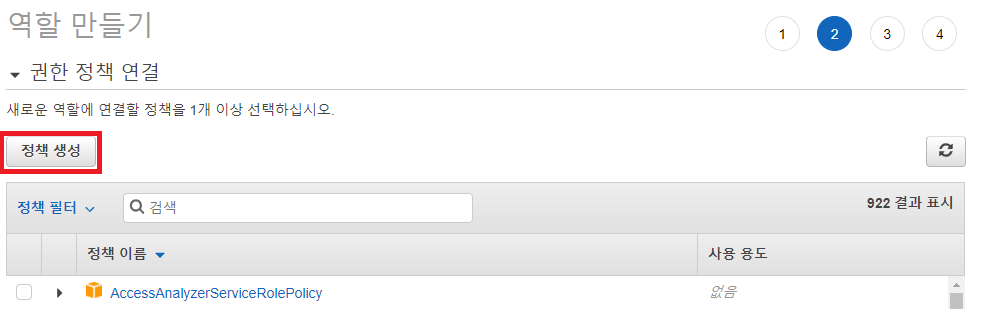
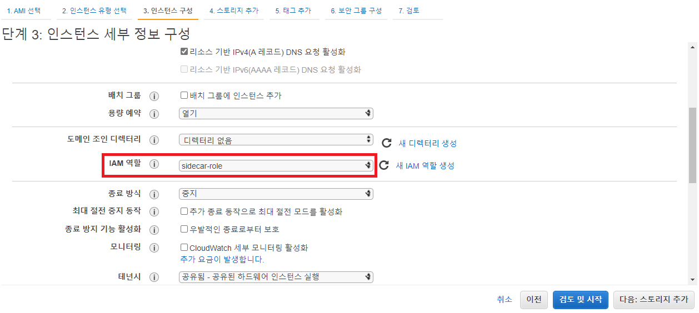

### [Index](https://github.com/PaaS-TA/Guide/blob/master/README.md) > [PaaS-TA Sidecar Install](./README.md) > Sidecar

## Table of Contents

1. [Document Outline](#1)  
  1.1. [Purpose](#1.1)  
  1.2. [Range](#1.2)  
  1.3. [References](#1.3)  

2. [Configuring a Kubernetes Cluster with Kubespray](#2)  
  2.1. [Prerequisite](#2.1)  
  2.2. [AWS Settings (When Using AWS Environment)](#2.2)  
    ※ [(Refer) AWS IAM Settings](#2.2.1)  
  2.3. [NFS 설정 (NFS 배포 시)](#2.3)  
  　2.3.1 [Linux Kernel 버전 업그레이드](#2.3.1)  
  　2.3.2 [NFS 설치](#2.3.2)  
  　　2.3.2.1 [Server](#2.3.2.1)  
  　　2.3.2.2 [Client](#2.3.2.2)  
  　　2.3.2.3 [테스트](#2.3.2.3)  
  2.4. [SSH Key 생성 및 배포](#2.4)  
  2.5. [Kubespray 다운로드](#2.5)  
  2.6. [Kubespray 설치 준비](#2.6)   
  2.7. [Change Kubespray Settings for Sidecar Installation](#2.7)  
  2.8. [Kubespray 설치](#2.8)  
  2.9. [Kubespray 설치 확인](#2.9)  
    ※ [(참고) Kubespray 삭제](#2.9.1)

3. [PaaS-TA Sidecar Installation](#3)  
  3.1. [Introduction to Executable Files](#3.1)  
  3.2. [Download Executable Files](#3.2)  
  3.3. [Istio CNI Plugin 활성화](#3.3)  
  3.4. [variable Settings](#3.4)  
  3.5. [Create Sidecar Values](#3.5)  
  3.6. [Create Sidecar Deployment YAML](#3.6)  
  3.7. [Sidecar Installation](#3.7)  
  　※ [LoadBalancer Domain Connection During AWS-Based Sidecar Installation](#3.7.1)  
  3.8. [Sidecar Login and Deployment of Test App](#3.8)  
    ※ [(Refer) Sidecar Deletion](#3.8.1)  

<br><br>

# <div id='1'> 1. Document Outline
## <div id='1.1'> 1.1. Purpose
The purpose of this document is to provide a guide for configuring the Kubernetes Cluster with Kubespray used for exclusive deployment of PaaS-TA Container-Platform and installing PaaS-TA Sidecar (hereinafter referred to as Sidecar) in the environment.

<br>

## <div id='1.2'> 1.2. Range
This Document was written based on [cf-for-k8s v5.4.2](https://github.com/cloudfoundry/cf-for-k8s/tree/v5.4.2), [paas-ta-container-platform v1.4.0.1](https://github.com/PaaS-TA/paas-ta-container-platform/blob/master/install-guide/standalone/cp-cluster-install.md).    
This document is based on the installation of Sidecar after configuring the Kubernetes Cluster by utilizing PaaS-TA Container-Platform Single Distribution (Kubespray) in AWS and Openstack environments.  
This document was guided on the premise that there was a basic understanding of IaaS and Kubernetes.  

<br>


## <div id='1.3'> 1.3. References
PaaS-TA Container Platform : [https://github.com/PaaS-TA/paas-ta-container-platform](https://github.com/PaaS-TA/paas-ta-container-platform)  
Kubespray : [https://kubespray.io](https://kubespray.io)  
Kubespray github : [https://github.com/kubernetes-sigs/kubespray](https://github.com/kubernetes-sigs/kubespray)  
cf-for-k8s github : [https://github.com/cloudfoundry/cf-for-k8s](https://github.com/cloudfoundry/cf-for-k8s)  
cf-for-k8s Document : [https://cf-for-k8s.io/docs/](https://cf-for-k8s.io/docs/)  

<br>

# <div id='2'> 2. Configuring a Kubernetes Cluster with Kubespray
The basic Kubernetes Cluster configuration method follows the PaaS-TA Container Platform solo deployment installation guide, but there are some options or parts to be modified on IaaS.
Since the Kubernetes Cluster configuration in this guide has been briefly modified in the linked standalone deployment installation guide, see the linked standalone deployment installation guide for a detailed description of the Kubernetes Cluster configuration.

<br>

## <div id='2.1'> 2.1. Prerequisite
Key software and package version information for Kubernetes Cluster configuration can be found in the PaaS-TA Container Platform Standalone Deployment Installation Guide.  
In addition, the cf-for-k8s official document recommends the Kubernetes Cluster requirements as follows.
- Kubernetes version : 1.19 ~ 1.22
- At least 5 nodes
- Minimum 4 CPUs per node, 15GB Memory
- Have CNI Plugin with Network Policies
- LoadBalancer Service Provided
- Default StorageClass Set
- Provides OCI-compliant registry (e.g. [Docker Hub](https://hub.docker.com/), [Google container registry](https://cloud.google.com/container-registry),  [Azure container registry](https://hub.docker.com/), [Harbor](https://goharbor.io/), etc....)  
  This guide is based on the Docker Hub. (Account registration required)

<br>

## <div id='2.2'> 2.2. AWS Settings (When Using AWS Environment)
When configuring a Kubernetes Cluster for Sidecar on AWS, IAM authorization is required on the instance that configures the cluster for use with LoadBalancer or Storage.
- Create an IAM role, add the following policy, and apply it when creating an instance. (Refer to AWS IAM settings below when checking the supplementary explanation about IAM settings.)
 ```
  # iam_policy.json
  {
      "Version": "2012-10-17",
      "Statement": [
          {
              "Effect": "Allow",
              "Action": [
                  "ec2:*"
              ],
              "Resource": [
                  "*"
              ]
          },
          {
              "Effect": "Allow",
              "Action": [
                  "elasticloadbalancing:*"
              ],
              "Resource": [
                  "*"
              ]
          },
          {
              "Effect": "Allow",
              "Action": [
                  "route53:*"
              ],
              "Resource": [
                  "*"
              ]
          },
          {
              "Effect": "Allow",
              "Action": "s3:*",
              "Resource": [
                  "arn:aws:s3:::kubernetes-*"
              ]
          },
          {
              "Effect": "Allow",
              "Action": [
                  "ecr:GetAuthorizationToken",
                  "ecr:BatchCheckLayerAvailability",
                  "ecr:GetDownloadUrlForLayer",
                  "ecr:GetRepositoryPolicy",
                  "ecr:DescribeRepositories",
                  "ecr:ListImages",
                  "ecr:BatchGetImage"
              ],
              "Resource": "*"
          }
      ]
  }
  ```

- Add the following tags to the **instance** to configure the cluster and the **subnet** tags used.
```
key = kubernetes.io/cluster/{cluster_name}
value = member
```


<br>

### <div id='2.2.1'> ※ (Refer) AWS IAM Settings
It describes how to set up AWS IAM.  

- AWS IAM Menu - From the Roles menu, select Create Role.  

  
- Proceed to Create Role to select Create Policy.  

  
- Select JSON and paste iam_policy.json at the top.  

  
- After creating a policy, return to Create Role to select the policy created.  

  
- Name it and complete the role.  

  
- Select the role that you created in the IAM role when configuring the EC2 instance.  

  
- If you have configured the instance and you have not set up the IAM, select the role you created by selecting Modify Instance - Task - Security - IAM Role and reboot the instance.  

  
<br>

## <div id='2.3'> 2.3. NFS 설정 (NFS 배포 시)
본 설치 가이드는 NFS Server는 **Ubuntu 18.04**, NFS Client는 **Ubuntu 20.04** 환경에서 설치하는 것을 기준으로 하였다. NFS Server의 경우 Kubespray로 배포된 Cluster에서 사용할 Storage용이기에 Storage용 별도 VM에 설치한다.

### <div id='2.3.1'> 2.3.1 Linux Kernel 버전 업그레이드
Linux Kernel 버전 **v5.9**부터 NFS에서 xattr이 지원되므로, 버전이 v5.8 이하인 경우 다음 작업을 수행해야 한다. Kubernetes Cluster가 설치되는 모든 Node와 NFS Server로 사용할 VM에서 진행한다.

- Linux Kernel 버전을 확인한다.
  ```
  $ uname -a
  Linux paasta-cp-master 4.15.0-206-generic #217-Ubuntu SMP Fri Feb 3 19:10:13 UTC 2023 x86_64 x86_64 x86_64 GNU/Linux
  ```


- 다음 경로에서 Linux Kernel 버전을 업그레이드 하는 데 필요한 *.deb 파일 다운로드를 진행한다. 본 설치 가이드에서의 Linux Kernel 버전은 **v5.9**이다.
  ```shell
  $ cd $HOME
  $ mkdir linux-kernel-5.9
  $ cd linux-kernel-5.9

  $ wget https://kernel.ubuntu.com/~kernel-ppa/mainline/v5.9/amd64/linux-headers-5.9.0-050900-generic_5.9.0-050900.202010112230_amd64.deb \
  https://kernel.ubuntu.com/~kernel-ppa/mainline/v5.9/amd64/linux-headers-5.9.0-050900_5.9.0-050900.202010112230_all.deb \
  https://kernel.ubuntu.com/~kernel-ppa/mainline/v5.9/amd64/linux-image-unsigned-5.9.0-050900-generic_5.9.0-050900.202010112230_amd64.deb \
  https://kernel.ubuntu.com/~kernel-ppa/mainline/v5.9/amd64/linux-modules-5.9.0-050900-generic_5.9.0-050900.202010112230_amd64.deb
  ```

- 다음 명령어를 실행하여 Linux Kernel 버전을 업그레이드 한다.
  ```
  $ sudo su
  # dpkg -i *.deb
  # reboot
  ```

- reboot 후 다시 접속하여 Linux Kernel 버전을 확인한다.
  ```
  $ uname -a
  Linux paasta-cp-master 5.9.0-050900-generic #202010112230 SMP Sun Oct 11 22:34:01 UTC 2020 x86_64 x86_64 x86_64 GNU/Linux
  ```

### <div id='2.3.2'> 2.3.2 NFS 설치
#### <div id='2.3.2.1'> 2.3.2.1 Server
- 패키지 업데이트 및 업그레이드를 진행한다.
  ```
  $ sudo apt -y update && sudo apt -y upgrade
  ```
- 패키지를 설치한다.
  ```
  $ sudo apt install -y nfs-common nfs-kernel-server rpcbind attr
  ```
- 사용 가능한 NFS 버전을 확인한다. xattr을 활성화하기 위해서는 버전 **v4.2** 이상이 필요하다.
  ```
  $ sudo cat /proc/fs/nfsd/versions
  # -2 +3 +4 +4.1 +4.2
  ```
- NFS에서 사용될 디렉토리를 생성하고 권한을 부여한다.
  ```shell
  $ sudo mkdir -p /home/share/nfs
  $ sudo chmod 777 /home/share/nfs
  ```
- 공유 디렉토리를 설정한다.
  ```shell
  $ sudo vi /etc/exports

  ## 형식 : [dir] [IP] [option]
  ## 예시 : /home/share/nfs 10.0.0.1(rw,no_subtree_check,no_root_squash,async)
  /home/share/nfs {{MASTER_NODE_PRIVATE_IP}}(rw,no_subtree_check,no_root_squash,async)
  /home/share/nfs {{WORKER1_NODE_PRIVATE_IP}}(rw,no_subtree_check,no_root_squash,async)
  /home/share/nfs {{WORKER2_NODE_PRIVATE_IP}}(rw,no_subtree_check,no_root_squash,async)
  ...
  ```
  > `rw` - 읽기쓰기  
  > `no_subtree_check` - 공유 디렉터리가 서브 디렉터리를 가질 수 있음  
  > `no_root_squash` - 클라이언트가 root 권한 획득 가능, 파일생성 시 클라이언트 권한으로 생성됨  
  > `async` - 요청에 의해 변경되기 전에 요청에 응답, 성능 향상용
- NFS 서버를 재시작한다.
  ```shell
  $ sudo /etc/init.d/nfs-kernel-server restart
  ```
- 설정을 확인한다.
  ```shell
  $ sudo exportfs -v
  ```
- 정상 결과
  ```
  /home/share/nfs
                <world>(rw,async,wdelay,no_root_squash,no_subtree_check,sec=sys,rw,secure,no_root_squash,no_all_squash)
  ```

#### <div id='2.3.2.2'> 2.3.2.2 Client
- 패키지 업데이트 및 업그레이드를 진행한다.
  ```
  $ sudo apt -y update && sudo apt -y upgrade
  ```
- 패키지를 설치한다.
  ```
  $ sudo apt -y install nfs-common attr
  ```
- NFS에서 사용될 디렉토리를 생성한다.
  ```shell
  $ sudo mkdir -p /home/share/nfs
  ```
- 공유 디렉토리를 설정한다.
  ```shell
  $ sudo vi /etc/fstab

  ## 형식 : [file system] [dir] [type] [option] [dump] [pass]
  ## 예시 : 10.10.10.122:/home/share/nfs  /home/share/nfs  nfs  noatime,nodiratime,noauto,hard,rsize=1048576,wsize=1048576,timeo=60,retrans=60  0 0
  {NFS_SERVER_PRIVATE_IP}:/home/share/nfs  /home/share/nfs  nfs  noatime,nodiratime,noauto,hard,rsize=1048576,wsize=1048576,timeo=60,retrans=60  0 0
  ```
  > `noatime` - 파일시스템 meta 정보에 file의 access time 기록하지 않음  
  > `nodiratime` - 파일시스템 meta 정보에 directory의 access time 기록하지 않음  
  > `noauto` - 부팅 시 자동으로 mount하지 않음  
  > `hard` - 하드 마운트  
  > `rsize` - NFS 서버에서 파일을 읽을 때 NFS가 사용하는 바이트 수 최대 읽기 버퍼의 크기  
  > `wsize` - NFS 서버에 파일을 쓸 때 NFS가 사용하는 바이트 수 최대 쓰기 버퍼의 크기  
  > `timeo` - 패킷을 재전송해야한다는 결론에 도달하기 전까지의 클라이언트 대기 시간  
  > `retrans` - `timeo`만큼 기다린 후의 재시도 횟수

- 파일 시스템을 마운트한다.
  ```shell
  $ sudo mount -t nfs -o vers=4.2 {NFS_SERVER_PRIVATE_IP}:/home/share/nfs /home/share/nfs
  ```
- 설정을 확인한다.
  ```
  $ mount | grep /home/share/nfs
  /dev/vda1 on /home/share/nfs type ext4 (rw,relatime)
  10.10.10.122:/home/share/nfs on /home/share/nfs type nfs4 (rw,relatime,vers=4.2,rsize=524288,wsize=524288,namlen=255,hard,proto=tcp,timeo=600,retrans=2,sec=sys,clientaddr=10.10.10.244,local_lock=none,addr=10.10.10.122)
  ```

#### <div id='2.3.2.3'> 2.3.2.3 테스트
- NFS Client
  ```
  $ cd /home/share/nfs
  
  $ touch test.txt
  $ printf bar | attr -s foo test.txt
  Attribute "foo" set to a 3 byte value for test.txt:
  bar
  $ attr -l test.txt
  Attribute "foo" has a 3 byte value for test.txt
  ```
- NFS Server
  ```
  $ attr -l /home/share/nfs/test.txt
  Attribute "foo" has a 3 byte value for /home/share/nfs/test.txt
  ```
  
<br>

## <div id='2.4'> 2.4. SSH Key 생성 및 배포
SSH Key 생성 및 배포 이후의 모든 설치과정은 **Master Node**에서 진행한다.

- Master Node에 접속하여 RSA 공개키를 생성한다.
  ```
  $ ssh-keygen -t rsa
  Generating public/private rsa key pair.
  Enter file in which to save the key (/home/ubuntu/.ssh/id_rsa): [엔터키 입력]
  Enter passphrase (empty for no passphrase): [엔터키 입력]
  Enter same passphrase again: [엔터키 입력]
  Your identification has been saved in /home/ubuntu/.ssh/id_rsa.
  Your public key has been saved in /home/ubuntu/.ssh/id_rsa.pub.
  The key fingerprint is:
  SHA256:pIG4/G309Dof305mWjdNz1OORx9nQgQ3b8yUP5DzC3w ubuntu@paasta-cp-master
  The key's randomart image is:
  +---[RSA 2048]----+
  |            ..= o|
  |   . .       * B |
  |  . . . .   . = *|
  | . .   +     + E.|
  |  o   o S     +.O|
  |   . o o .     XB|
  |    . o . o   *oO|
  |     .  .. o B oo|
  |        .o. o.o  |
  +----[SHA256]-----+
  ```

- 사용할 Master, Worker Node에 공개키를 복사한다.
  ```
  ## 출력된 공개키 복사
  
  $ cat ~/.ssh/id_rsa.pub
  ssh-rsa AAAAB3NzaC1yc2EAAAADAQABAAABAQC5QrbqzV6g4iZT4iR1u+EKKVQGqBy4DbGqH7/PVfmAYEo3CcFGhRhzLcVz3rKb+C25mOne+MaQGynZFpZk4muEAUdkpieoo+B6r2eJHjBLopn5quWJ561H7EZb/GlfC5ThjHFF+hTf5trF4boW1iZRvUM56KAwXiYosLLRBXeNlub4SKfApe8ojQh4RRzFBZP/wNbOKr+Fo6g4RQCWrr5xQCZMK3ugBzTHM+zh9Ra7tG0oCySRcFTAXXoyXnJm+PFhdR6jbkerDlUYP9RD/87p/YKS1wSXExpBkEglpbTUPMCj+t1kXXEJ68JkMrVMpeznuuopgjHYWWD2FgjFFNkp ubuntu@paasta-cp-master
  ```

- 사용할 Master, Worker Node의 authorized_keys 파일 본문의 마지막 부분(기존 본문 내용 아래 추가)에 공개키를 복사한다.
  ```
  $ vi ~/.ssh/authorized_keys

  ex)
  ssh-rsa AAAAB3NzaC1yc2EAAAADAQABAAABAQDRueywSiuwyfmCSecHu7iwyi3xYS1xigAnhR/RMg/Ws3yOuwbKfeDFUprQR24BoMaD360uyuRaPpfqSL3LS9oRFrj0BSaQfmLcMM1+dWv+NbH/vvq7QWhIszVCLzwTqlHrhgNsh0+EMhqc15KEo5kHm7d7vLc0fB5tZkmovsUFzp01Ceo9+Qye6+j+UM6ssxdTmatoMP3ZZKZzUPF0EZwTcGG6+8rVK2G8GhTqwGLj9E+As3GB1YdOvr/fsTAi2PoxxFsypNR4NX8ZTDvRdAUzIxz8wv2VV4mADStSjFpE7HWrzr4tZUjvvVFptU4LbyON9YY4brMzjxA7kTuf/e3j Generated-by-Nova
  ssh-rsa AAAAB3NzaC1yc2EAAAADAQABAAABAQC5QrbqzV6g4iZT4iR1u+EKKVQGqBy4DbGqH7/PVfmAYEo3CcFGhRhzLcVz3rKb+C25mOne+MaQGynZFpZk4muEAUdkpieoo+B6r2eJHjBLopn5quWJ561H7EZb/GlfC5ThjHFF+hTf5trF4boW1iZRvUM56KAwXiYosLLRBXeNlub4SKfApe8ojQh4RRzFBZP/wNbOKr+Fo6g4RQCWrr5xQCZMK3ugBzTHM+zh9Ra7tG0oCySRcFTAXXoyXnJm+PFhdR6jbkerDlUYP9RD/87p/YKS1wSXExpBkEglpbTUPMCj+t1kXXEJ68JkMrVMpeznuuopgjHYWWD2FgjFFNkp ubuntu@paasta-cp-master  
  ```
<br>

## <div id='2.5'> 2.5. Kubespray 다운로드
- git clone 명령을 통해 다음 경로에서 Kubespray 다운로드를 진행한다. 본 설치 가이드에서의 paas-ta-container-platform의 버전은 **v1.4.0.1**이며 Kubespray 버전은 **v2.20.0** 이다.
  ```
  $ git clone https://github.com/PaaS-TA/paas-ta-container-platform-deployment.git -b v1.4.0.1
  ```

<br>

## <div id='2.6'> 2.6. Kubespray 설치 준비

Kubespray 설치에 필요한 환경변수를 사전 정의 후 쉘 스크립트를 통해 설치를 진행한다.

- Kubespray 설치경로로 이동한다.
  ```
  $ cd paas-ta-container-platform-deployment/standalone/single_control_plane
  ```

- Kubespray 설치에 필요한 환경변수를 정의한다. HostName, IP 정보는 다음을 통해 확인할 수 있다.
  ```
  $ vi cp-cluster-vars.sh
  ```

  ```shell
  ## HostName 정보 = 각 호스트의 쉘에서 hostname 명령어 입력
  ## Private IP 정보 = 각 호스트의 쉘에서 ifconfig 입력 후 inet ip 입력
  ## Public IP 정보 = 할당된 Public IP 정보 입력, 미 할당 시 Private IP 정보 입력

  #!/bin/bash

  export MASTER_NODE_HOSTNAME={Master Node의 HostName 정보 입력}
  export MASTER_NODE_PUBLIC_IP={Master Node의 Public IP 정보 입력}
  export MASTER_NODE_PRIVATE_IP={Master Node의 Private IP 정보 입력}

  ## Worker Node Count Info
  export WORKER_NODE_CNT={Worker Node의 갯수}

  ## Add Worker Node Info
  export WORKER1_NODE_HOSTNAME={Worker 1번 Node의 HostName 정보 입력}
  export WORKER1_NODE_PRIVATE_IP={Worker 1번 Node의 Private IP 정보 입력}
  export WORKER2_NODE_HOSTNAME={Worker 2번 Node의 HostName 정보 입력}
  export WORKER2_NODE_PRIVATE_IP={Worker 2번 Node의 Private IP 정보 입력}
  export WORKER3_NODE_HOSTNAME={Worker 3번 Node의 HostName 정보 입력}
  export WORKER3_NODE_PRIVATE_IP={Worker 3번 Node의 Private IP 정보 입력}
  ...
  export WORKER{n}_NODE_HOSTNAME={Worker Node의 갯수에 맞춰 HostName 정보 변수 추가}
  export WORKER{n}_NODE_PRIVATE_IP={Worker Node의 갯수에 맞춰 Private IP 정보 변수 추가}
  ```

- 선택할 스토리지를 선택한다.
  Node에 볼륨 추가가 불가능할 경우 NFS를, 볼륨 추가가 가능할 경우 Rook-Ceph을 선택하는 것을 권장한다.
  NFS 선택 시 NFS Server의 Private IP 정보를 입력한다.

  ```shell
  ...
  ## Storage Type Info (eg. nfs, rook-ceph)
  export STORAGE_TYPE={설치할 Storage Type 정보 입력}
  export NFS_SERVER_PRIVATE_IP={Storage Type nfs 설정 시 NFS Server의 Private IP 정보 입력}
  ...
  ```

<br>

## <div id='2.7'> 2.7. Change Kubespray Settings for Sidecar Installation
- `metrics_server_version`을 v0.6.4로 변경한다.
  ```
  $ vi roles/download/defaults/main.yml
  ```

  ```yaml
  ...
  metrics_server_version: "v0.6.4"
  ...
  ```

- 다음 부분을 주석처리 한다.
  ```
  $ vi cluster.yml
  ```

  ```yaml
  ...

  # - hosts: kube_control_plane
  # gather_facts: False
  # any_errors_fatal: "{{ any_errors_fatal | default(true) }}"
  # environment: "{{ proxy_disable_env }}"
  # roles:
  #   - { role: kubespray-defaults }
  #   - { role: paasta-cp/istio }
  
  ...
  
  # - hosts: kube_control_plane
  # gather_facts: False
  # any_errors_fatal: "{{ any_errors_fatal | default(true) }}"
  # environment: "{{ proxy_disable_env }}"
  # roles:
  #   - { role: kubespray-defaults }
  #   - { role: paasta-cp/kubeflow }

  ...
  ```
  <br>

## <div id='2.8'> 2.8. Kubespray 설치
쉘 스크립트를 통해 필요 패키지 설치, Node 구성정보 설정, Kubespray 설치정보 설정, Ansible playbook을 통한 Kubespray 설치를 일괄적으로 진행한다.

```
$ source deploy-cp-cluster.sh
```

<br>

## <div id='2.9'> 2.9. Kubespray 설치 확인
Kubernetes Node 및 kube-system Namespace의 Pod를 확인하여 Kubespray 설치를 확인한다.

```
$ kubectl get nodes
NAME                 STATUS   ROLES                  AGE   VERSION
paasta-cp-master     Ready    control-plane          12m   v1.24.6
paasta-cp-worker-1   Ready    <none>                 10m   v1.24.6
paasta-cp-worker-2   Ready    <none>                 10m   v1.24.6
paasta-cp-worker-3   Ready    <none>                 10m   v1.24.6
paasta-cp-worker-4   Ready    <none>                 10m   v1.24.6

$ kubectl get pods -n kube-system
NAME                                          READY   STATUS    RESTARTS      AGE
calico-node-d8sg6                             1/1     Running   0             9m22s
calico-node-kfvjx                             1/1     Running   0             10m
calico-node-khwdz                             1/1     Running   0             10m
calico-node-nc58v                             1/1     Running   0             10m
coredns-657959df74-td5c2                      1/1     Running   0             8m15s
coredns-657959df74-ztnjj                      1/1     Running   0             8m7s
dns-autoscaler-b5c786945-rhlkd                1/1     Running   0             8m9s
kube-apiserver-paasta-cp-master               1/1     Running   0             12m
kube-controller-manager-paasta-cp-master      1/1     Running   1 (11m ago)   12m
kube-proxy-dj5c8                              1/1     Running   0             10m
kube-proxy-kkvhk                              1/1     Running   0             10m
kube-proxy-nfttc                              1/1     Running   0             10m
kube-proxy-znfgk                              1/1     Running   0             10m
kube-scheduler-paasta-cp-master               1/1     Running   1 (11m ago)   12m
metrics-server-5cd75b7749-xcrps               2/2     Running   0             7m57s
nginx-proxy-paasta-cp-worker-1                1/1     Running   0             10m
nginx-proxy-paasta-cp-worker-2                1/1     Running   0             10m
nginx-proxy-paasta-cp-worker-3                1/1     Running   0             10m
nodelocaldns-556gb                            1/1     Running   0             8m8s
nodelocaldns-8dpnt                            1/1     Running   0             8m8s
nodelocaldns-pvl6z                            1/1     Running   0             8m8s
nodelocaldns-x7grn                            1/1     Running   0             8m8s
```


<br>

### <div id='2.9.1'> ※ (참고) Kubespray 삭제
Use Ansible playbook and delete Kubespray.

```
$ source reset-cp-cluster.sh
```

<br>

# <div id='3'> 3. PaaS-TA Sidecar Installation
## <div id='3.1'> 3.1. Introduction to Executable Files
- The following executable files are required to install and use the Sidecar.

  | 이름   |      설명      |
  |----------|-------------|
  | [ytt](https://carvel.dev/ytt/) | Sidecar를 배포 시 사용 되는 YAML을 생성하는 툴 |
  | [kapp](https://carvel.dev/kapp/) | Sidecar의 라이프사이클을 관리하는 툴 |
  | [kubectl](https://github.com/kubernetes/kubectl) | Kubernetes Cluster를 제어하는 툴 |
  | [bosh cli](https://github.com/cloudfoundry/bosh-cli) | Sidecar에서 사용될 임의의 비밀번호와 certificate를 생성하는 툴 |
  | [cf cli](https://github.com/cloudfoundry/cli) (v7+) | Sidecar와 상호 작용하는 툴 |

<br>

- The script used to install Sidecar is as follows:

  | 이름   |      설명      | 비고 |
  |----------|-------------|----|
  | utils-install.sh | Sidecar 설치 & 활용 시 사용되는 툴 설치 스크립트 | ytt, kapp, bosh cli, cf cli 설치 |
  | variables.yml | Sidecar 설치 시 적용하는 변수 설정 파일 ||
  | 1.generate-values.sh | Sidecar 설치 시 사용 할 비밀번호, certificate등의 설정을 갖고있는 Manifest를 생성하는 스크립트 ||
  | 2.rendering-values.sh | 비밀번호, certificate등의 설정을 갖고있는 Manifest를 활용해 YAML을 생성하는 스크립트 ||
  | 3.deploy-sidecar.sh | 생성된 YAML을 이용하여 Sidecar를 설치하는 스크립트 ||
  | delete-sidecar.sh | Sidecar를 삭제하는 스크립트 ||
  | enable-istio-cni-plugin.sh | Istio CNI Plugin을 활성화 하는 스크립트 ||
  | deploy-inject-self-signed-cert.sh | 자체 서명된 인증서를 사용하는 Private 레지스트리 사용 시 POD에 CA를 삽입하는 보조 스크립트 | 자세한 가이드는 deploy-inject-self-signed-cert.sh 파일 안 설명이나 [cert-injection-webhook](https://github.com/vmware-tanzu/cert-injection-webhook) 참고 |
  | delete-inject-self-signed-cert.sh | inject-self-signed-cert를 삭제하는 스크립트 |  |
  | install-test.sh | 설치 후 Test App을 배포하여 확인하는 스크립트 ||

<br>

## <div id='3.2'> 3.2. Download Executable Files

- git clone 명령을 통해 다음 경로에서 Sidecar 다운로드를 진행한다. 본 설치 가이드에서의 Sidecar의 버전은 v1.0.3 버전이다.
  ```
  $ cd $HOME
  $ git clone https://github.com/PaaS-TA/sidecar-deployment.git -b v1.0.3
  $ cd sidecar-deployment/install-scripts
  ```

<br>

- Run the utils-install.sh file and install the files needed for Sidecar installation.
```
$ source utils-install.sh
```

<br>

## <div id='3.3'> 3.3. Istio CNI Plugin 활성화

- enable-istio-cni-plugin.sh 파일을 실행하여 Istio CNI Plugin을 활성화한다.
  ```
  $ source enable-istio-cni-plugin.sh

...
...
...

NAME                                         READY   STATUS    RESTARTS   AGE   IP               NODE                  NOMINATED NODE   READINESS GATES
pod/istio-operator-1-12-6-559bb4bc96-vf9nj   1/1     Running   0          2h    10.233.119.197   paasta-cp-worker-4    <none>           <none>

NAME                            TYPE        CLUSTER-IP     EXTERNAL-IP   PORT(S)      AGE   SELECTOR
service/istio-operator-1-12-6   ClusterIP   10.233.29.48   <none>        8383/TCP     2h    name=istio-operator

NAME                                    READY   UP-TO-DATE   AVAILABLE   AGE   CONTAINERS       IMAGES                                  SELECTOR
deployment.apps/istio-operator-1-12-6   1/1     1            1           2h    istio-operator   gcr.io/istio-testing/operator:latest    name=istio-operator

NAME                                               DESIRED   CURRENT   READY   AGE   CONTAINERS       IMAGES                                  SELECTOR
replicaset.apps/istio-operator-1-12-6-559bb4bc96   1         1         1       2h    istio-operator   gcr.io/istio-testing/operator:latest    name=istio-operator,pod-template-hash=559bb4bc96
  ```

<br>

## <div id='3.4'> 3.4. variable 설정
- variables.yml 파일을 편집하여 Sidecar 설치 시 옵션들을 설정한다.
  ```
$ vi variables.yml
  ```
  ```yaml
  ## COMMON VARIABLE
  iaas=aws                                                    # IaaS (e.g. aws or openstack)
  system_domain=sidecar.com                                   # sidecar system_domain (e.g. 3.35.135.135.nip.io)
  use_lb=true                                                 # (e.g. true or false)
  public_ip=3.35.135.135                                      # LoadbalancerIP (PublicIP associcated with system_domain, if use openstack)
  storageclass_name=ebs-sc                                    # Storage Class Name ($ kubectl get sc)


  ## APP_REGISTRY VARIABLE
  app_registry_kind=dockerhub                                 # Registry Kind (e.g. dockerhub or private)
  app_registry_repository=repository_name                     # Repository Name
  app_registry_id=registry_id                                 # Registry ID
  app_registry_password=registry_password                     # Registry Password

  app_registry_address=harbor00.nip.io                        # if app_registry_kind==private, fill in app_registry_address
  is_self_signed_certificate=false                            # is private registry use self-signed certificate? (e.g. true or false)
  app_registry_cert_path=support-files/private-repository.ca  # if is_self_signed_certificate==true --> add the contents of the private-repository.ca file
                                                              # if is_self_signed_certificate==false --> private-repository.ca is empty
  ## PORTAL Variable
  webuser_name="portal-web-user"
  uaa_client_portal_secret="clientsecret"
  
  ## EXTERNAL BLOBSTORE VARIABLE (Option)
  use_external_blobstore=false                                # (e.g. true or false)
  external_blobstore_ip=192.50.50.50                          # Blobstore Address (e.g. 127.0.0.1)
  external_blobstore_port=9000                                # Blobstore Port (e.g. 9000)
  external_blobstore_id=admin                                 # Blobstore ID
  external_blobstore_password=adminpw                         # Blobstore Password
  external_blobstore_package_directory=cc-package             # Blobstore Package Directory
  external_blobstore_droplet_directory=cc-droplet             # Blobstore Droplet Directory
  external_blobstore_resource_directory=cc-resource           # Blobstore Resource Directory
  external_blobstore_buildpack_directory=cc-buildpack         # Blobstore Buildpack Directory


  ## EXTERNAL DB VARIABLE (Option)
  use_external_db=false                                       # (e.g. true or false)
  external_db_kind=postgres                                   # External DB Kind(e.g. postgres or mysql)
  external_db_ip=10.100.100.100                               # External DB IP
  external_db_port=5432                                       # External DB Port
  external_cc_db_id=cloud_controller                          # Cloud Controller DB ID
  external_cc_db_password=cc_admin                            # Cloud Controller DB Password
  external_cc_db_name=cloud_controller                        # Cloud Controller DB Name
  external_uaa_db_id=uaa                                      # UAA DB ID
  external_uaa_db_password=uaa_admin                          # UAA DB Password
  external_uaa_db_name=uaa                                    # UAA DB Name
  external_db_cert_path=support-files/db.ca                   # if DB use cert --> add the contents of the db.ca file
                                                              # if DB don't use cert --> db.ca is empty
  ```
- 주요 변수의 설명은 다음과 같다.

  | 이름   |      설명      |
  |----------|-------------|
  | iaas | Cluster가 구성된 IaaS (aws, openstack) |
  | system_domain | Sidecar의 도메인(LoadBalancer와 연결되는 Domain) |
  | use_lb | LoadBalancer 사용 여부 (사용 안할 시 system_domain을 Cluster Worker중 하나의 PublicIP와 연결된 system_domain으로 설정) <br> (e.g. Cluster Worker Floating IP : 3.50.50.50 -> system_domain : 3.50.50.50.nip.io 혹은 연결된 도메인 설정)|
  | public_ip | LoadBalancer의 IP(클라우드 공급자가 제공하는 로드밸런서가 IP를 사용할 경우 설정) <br> (e.g. Openstack의 Octavia 사용 시) |
  | storageclass_name | 사용할 Storageclass |
  | app_registry_kind | Registry 종류 (dockerhub, private) |
  | app_registry_address | app_registry_kind가 private일 경우 Registry 주소 입력 |
  | use_external_blobstore | 외부 블롭스토어(minIO)를 사용할 경우 (true, false)|
  | use_external_db | 외부 데이터베이스(postgres, mysql)를 사용할 경우 (true, false) |

<br>

## <div id='3.5'> 3.5. Create Sidecar values
- Execute a script that creates values to be used when installing Sidecar.
  (설치 중 variables.yml을 수정하였다면 1.generate-values.sh부터 재시작 한다.)
  ```
  $ source 1.generate-values.sh
  ```
<br>

- The Manifest file is created in manifest/sidecar-values.yml, and various values can be checked and modified.   
  (Check the available variables from the [Link](https://cf-for-k8s.io/docs/platform_operators/config-values/).)

  ```
  $ vi manifest/sidecar-values.yml
  ```
  ```yaml
  #@data/values
  ---
  system_domain: "system_domain"
  app_domains:
  #@overlay/append
  - "apps.system_domain"
  cf_admin_password: 0pnasdfggpq58hq78vwm

  blobstore:
    secret_access_key: qkw95zasdfgrhr5dg1v4

  cf_db:
    admin_password: vqorcaldasdfgz4jp8h
  .....
  .....

  app_registry:
    hostname: https://index.docker.io/v1/
    repository_prefix: "dockerhub_repository_name"
    username: "dockerhub_id"
    password: "dockerhub_password"
  ```

<br>

## <div id='3.6'> 3.6. Create Sidecar Deployment YAML

- Create a YAML to install Sidecar using the created sidecar-values.yml file.  
  (If sidecar-values.yml was modified during installation, restart with 2.rendering-values.sh.)
```
$ source 2.rendering-values.sh
```
<br>

- The YAML file is created at the manifest/sidecar-rendered.yml. Checking of the deployed resource and modification can be done through Kubernetes.

  ```
  $ vi manifest/sidecar-rendered.yml
  ```
  ```yaml
  apiVersion: kapp.k14s.io/v1alpha1
  kind: Config
  metadata:
    name: kapp-version
  minimumRequiredVersion: 0.33.0
  ---
  apiVersion: kapp.k14s.io/v1alpha1
  kind: Config
  metadata:
    name: kapp-istio-gateway-rules
  .....
  ```
  
<br>

## <div id='3.7'> 3.7. Sidecar Installation
- Install Sidecar using the generated YAML file.
```
$ source 3.deploy-sidecar.sh

  ........
  6:43:21AM:  L ok: waiting on pod/restart-workloads-for-istio1-12-6-pmtlv (v1) namespace: cf-workloads
  6:43:25AM: ok: reconcile job/restart-workloads-for-istio1-12-6 (batch/v1) namespace: cf-workloads
  6:43:25AM:  ^ Completed
  6:43:25AM: ---- applying complete [301/301 done] ----
  6:43:25AM: ---- waiting complete [301/301 done] ----


  Succeeded
```

- When Sidecar is installed normally, the POD is configured as follows:
  ```
  $ kubectl get pods -A
  
  NAMESPACE       NAME                                                     READY   STATUS      RESTARTS      AGE
  cf-blobstore    cf-blobstore-minio-8699cf546d-vzx9m                      1/1     Running     0             2h
  cf-db           cf-db-postgresql-0                                       1/1     Running     0             2h
  cf-system       ccdb-migrate-f9srj                                       0/1     Completed   0             2h
  cf-system       cf-api-clock-5445db578f-kqplk                            1/1     Running     0             2h
  cf-system       cf-api-controllers-7cffd654d8-mr897                      2/2     Running     0             2h
  cf-system       cf-api-deployment-updater-7846b77c95-q48tj               1/1     Running     0             2h
  cf-system       cf-api-server-ccd7b6d6c-jq4l5                            5/5     Running     0             2h
  cf-system       cf-api-worker-7cd4498648-zt7gb                           2/2     Running     0             2h
  cf-system       eirini-api-6c7d94789c-fgwdr                              1/1     Running     0             2h
  cf-system       eirini-app-migration-xmsp7                               0/1     Completed   0             2h
  cf-system       eirini-event-reporter-585b97b9bd-qbl6p                   1/1     Running     0             2h
  cf-system       eirini-event-reporter-585b97b9bd-tvshd                   1/1     Running     0             2h
  cf-system       eirini-instance-index-env-injector-6b4c5c4bf9-22wfn      1/1     Running     0             2h
  cf-system       eirini-task-reporter-85c5dcb56f-6whpr                    1/1     Running     0             2h
  cf-system       eirini-task-reporter-85c5dcb56f-jhrzb                    1/1     Running     0             2h
  cf-system       fluentd-4kbl6                                            1/1     Running     0             2h
  cf-system       fluentd-l24lx                                            1/1     Running     0             2h
  cf-system       fluentd-l2f8q                                            1/1     Running     0             2h
  cf-system       fluentd-mqfrj                                            1/1     Running     0             2h
  cf-system       fluentd-tzjlt                                            1/1     Running     0             2h
  cf-system       log-cache-backend-6d4f986c96-rmzwm                       2/2     Running     0             2h
  cf-system       log-cache-frontend-7799b59c9f-lv6z2                      2/2     Running     0             2h
  cf-system       metric-proxy-5bb8d4965-h7nrb                             1/1     Running     0             2h
  cf-system       routecontroller-887f9878d-2mjlc                          1/1     Running     0             2h
  cf-system       uaa-8ddd86c4-k45kd                                       2/2     Running     0             2h
  cf-workloads    restart-workloads-for-istio1-12-6-pmtlv                  0/1     Completed   0             2h
  istio-system    istio-ingressgateway-46tx9                               2/2     Running     0             2h
  istio-system    istio-ingressgateway-kk89r                               2/2     Running     0             2h
  istio-system    istio-ingressgateway-zml5q                               2/2     Running     0             2h
  istio-system    istio-ingressgateway-pkjv9                               2/2     Running     0             2h
  istio-system    istio-ingressgateway-qdmbf                               2/2     Running     0             2h
  istio-system    istio-operator-1-12-6-559bb4bc96-vf9nj                   1/1     Running     0             2h
  istio-system    istiod-56c7f5bc65-mbmtt                                  1/1     Running     0             2h
  istio-system    istiod-56c7f5bc65-qrxc6                                  1/1     Running     0             2h
  kpack           kpack-controller-966c8d5fb-2lqmn                         2/2     Running     0             2h
  kpack           kpack-webhook-7b57486ddf-zwfnx                           2/2     Running     0             2h
  .....
  ```

<br>

### <div id='3.7.1'> ※ LoadBalancer Domain Connection During AWS-Based Sidecar Installation
When using AWS LoadBalancer, a domain connection using Route53 is required.
- Check AWS LoadBalancer Name

  ```
  $ kubectl get svc -n istio-system istio-ingressgateway
  NAME                   TYPE           CLUSTER-IP      EXTERNAL-IP                                                                    PORT(S)                                                      AGE
  istio-ingressgateway   LoadBalancer   10.233.28.216   a0c35cf15801c4557a9b49b3a97f86ef-1468743017.ap-northeast-2.elb.amazonaws.com   15021:32733/TCP,80:30412/TCP,443:31913/TCP,15443:31820/TCP   2h
  ```

- After creating a hosting area on Route 53, enter the LoadBalancer name (EXTERNAL-IP) in the routing target and generate a record.


<br>

## <div id='3.8'> 3.8. Sidecar Login and Deployment of Test App
- Deploy the test app to check if the app was deployed normally.
  ```
  # 배포 자동 테스트
  $ source install-test.sh
  .......
  Waiting for app test-node-app to start...
  
  Instances starting...
  Instances starting...
  
  name:                test-node-app
  requested state:     started
  isolation segment:   placeholder
  routes:              test-node-app.apps.system.domain
  last uploaded:       Thu 30 Sep 07:04:54 UTC 2021
  stack:               
  buildpacks:          
  isolation segment:   placeholder
  
  type:            web
  sidecars:        
  instances:       1/1
  memory usage:    1024M
  start command:   node server.js
    state     since                  cpu    memory   disk     details
  #0   running   2021-09-30T07:06:01Z   0.0%   0 of 0   0 of 0   
  ==============================
  check output 'Hello World'
  Hello World
  ==============================
  
  
  
  # 배포 수동 테스트
  $ cf login -a api.$(grep system_domain ./manifest/sidecar-values.yml | cut -d" " -f2 | sed -e 's/\"//g') --skip-ssl-validation -u admin -p "$(grep cf_admin_password ./manifest/sidecar-values.yml | cut -d" " -f2)"
  
  Authenticating...
  OK
  
  Targeted org system.
  
  API endpoint:   https://api.<system_domain>
  API version:    3.104.0
  user:           admin
  org:            system
  space:          No space targeted, use 'cf target -s SPACE'
  


$ cf create-space test-space
Creating space test-space in org system as admin...
OK

Assigning role SpaceManager to user admin in org system/space test-space as admin...
OK

Assigning role SpaceDeveloper to user admin in org system/space test-space as admin...
OK

TIP: Use 'cf target -o "system" -s "test-space"' to target new space


$ cf target -s test-space
API endpoint:   https://api.<system_domain>
API version:    3.104.0
user:           admin
org:            system
space:          test-space


$ cf push -p ../tests/smoke/assets/test-node-app/ test-node-app
Pushing app test-node-app to org system / space test-space as admin...
Packaging files to upload...
Uploading files...
 558 B / 558 B [============================================================] 100.00% 1s

Waiting for API to complete processing files...
.......
.......
Build successful

Waiting for app test-node-app to start...

Instances starting...
Instances starting...

name:                test-node-app
requested state:     started
isolation segment:   placeholder
routes:              test-node-app.apps.system.domain
last uploaded:       Thu 30 Sep 07:04:54 UTC 2021
stack:               
buildpacks:          
isolation segment:   placeholder

type:            web
sidecars:        
instances:       1/1
memory usage:    1024M
start command:   node server.js
  state     since                  cpu    memory   disk     details
#0   running   2021-09-30T07:06:01Z   0.0%   0 of 0   0 of 0   


$ curl -k https://test-node-app.apps.system.domain
Hello World

```

<br>
  
### <div id='3.8.1'> ※ (Refer) Sidecar Deletion
```
$ source delete-sidecar.sh
```

<br>

  
### [Index](https://github.com/PaaS-TA/Guide/blob/master/README.md) > [PaaS-TA Sidecar Install](./README.md) > Sidecar
